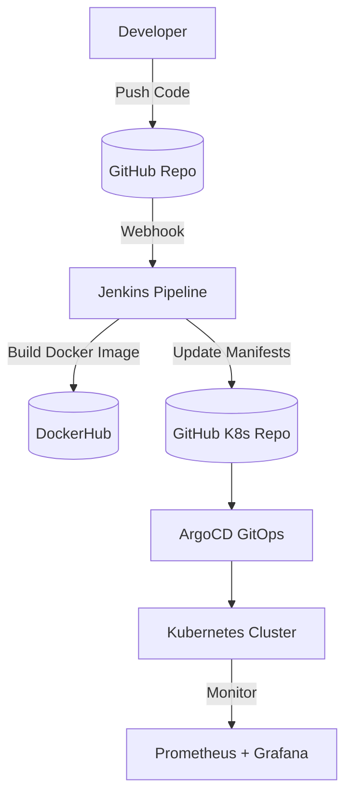

g# End-to-End CI/CD Pipeline for Java Application  

      

##  Project Overview  
This project demonstrates a **fully automated CI/CD pipeline for a Java application**, built on top of AWS cloud infrastructure.  
It integrates **Infrastructure as Code, automation, GitOps, and monitoring** into a single workflow to deliver **scalable, reliable, and observable deployments**.  

The solution provisions infrastructure, configures Kubernetes nodes, sets up continuous delivery with ArgoCD, and enables monitoring using the Prometheus stack.  

---

##  Tech Stack  
- **Cloud & Infrastructure:** AWS (EC2, networking, storage)  
- **Infrastructure as Code:** Terraform  
- **Configuration Management:** Ansible  
- **Containerization & Orchestration:** Docker, Kubernetes  
- **CI/CD:** Jenkins (with shared libraries), GitHub Actions (optional)  
- **GitOps:** ArgoCD  
- **Monitoring & Logging:** Prometheus, Grafana  
- **Other Tools:** Helm, DockerHub, GitHub  

---

##  Architecture  



### Workflow:
1. **Terraform** provisions AWS infrastructure (EC2 instances, networking, security groups).  
2. **Ansible** configures Kubernetes nodes, installs dependencies.  
3. **Helm** installs ArgoCD & Prometheus stack.  
4. **Jenkins** builds Docker images, pushes them to DockerHub, and updates Kubernetes manifests in GitHub.  
5. **ArgoCD** syncs the manifests → automatically deploys to Kubernetes.  
6. **Prometheus + Grafana** monitor the app & cluster health.  

---

## 🔗 Jenkins Shared Library
This project uses a [Jenkins Shared Library]([https://github.com/YourUser/your-jenkins-shared-lib](https://github.com/Salieri20/jenkins-shared-lib)) 
to standardize pipeline stages (build, test, Docker image push, deploy).  

--- 

##  Setup & Deployment  

### Infrastructure Provisioning with Terraform  
```bash
cd terraform
terraform init
terraform apply
```

###  Configure Nodes with Ansible  
```bash
ansible-playbook -i inventory playbook-aws.yaml
```

###  Deploy ArgoCD with Helm  
```bash
helm repo add argo https://argoproj.github.io/argo-helm
helm install argocd argo/argo-cd -n argocd --create-namespace
```

Expose ArgoCD:  
```bash
kubectl patch svc argocd-server -n argocd -p '{"spec": {"type": "NodePort"}}'
```

### Setup Jenkins on Master Node  
- Install Jenkins as a service.  
- Add `jenkins` user to `docker` group.  
- Configure credentials (DockerHub, GitHub).  
- Add shared library for pipelines.  

### Build & Deploy  
- Push code → Jenkins builds & pushes Docker image.  
- Jenkins updates K8s manifests repo with new image tag.  
- ArgoCD auto-syncs → new version deployed with zero downtime.  

###  Monitoring with Prometheus & Grafana  
```bash
helm repo add prometheus-community https://prometheus-community.github.io/helm-charts
helm install prom prometheus-community/kube-prometheus-stack -n monitoring --create-namespace
```

Expose Grafana:  
```bash
kubectl patch svc prom-grafana -n monitoring -p '{"spec": {"type": "NodePort"}}'
```

---

## Key Outcomes  
- **80% reduction** in manual setup effort (Terraform + Ansible).  
- **Zero-downtime deployments** with ArgoCD GitOps.  
- **Release time cut from hours to minutes** with Jenkins pipelines.  
- **50% faster debugging** with Prometheus & Grafana monitoring stack.  

---

## Repository Structure  
```
├── terraform/              # Terraform IaC configs for AWS
├── ansible/                # Ansible inventory + playbooks
├── manifests/              # Kubernetes manifests (ArgoCD syncs from here)
└── java-app/               # Java application source code
```

---

## References  
- [Terraform](https://www.terraform.io/)  
- [Ansible](https://www.ansible.com/)  
- [Jenkins](https://www.jenkins.io/)  
- [ArgoCD](https://argo-cd.readthedocs.io/)  
- [Prometheus](https://prometheus.io/)  
- [Grafana](https://grafana.com/)  
